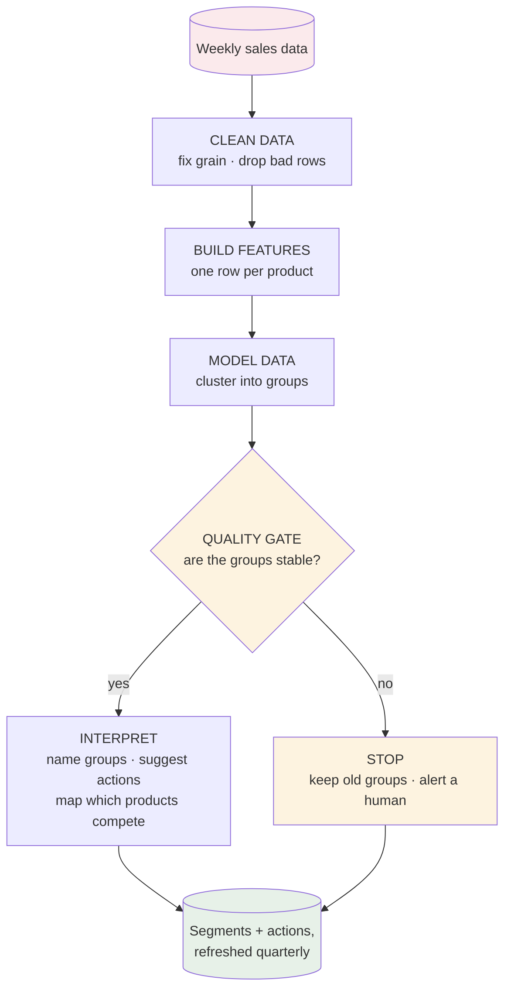

# RGMx Product Segmentation

Three years of weekly sales for UK dishwashing products across six retailers — 366 products in
the raw file, 353 after cleaning. The goal is to group products that sell in similar ways, so
pricing and promotion can be set per group instead of per product, and to find which products
push each other around.

---

## What's here

| | |
|---|---|
| [`notebooks/product_segmentation.ipynb`](notebooks/) | The analysis, in **pandas**. Solution is here. |
| [`notebooks/00_run_pipeline.ipynb`](notebooks/) | Runs the same logic from `src/`, in **PySpark**, the way a scheduled job would (draft version). |
| [`src/`](src/) | Five steps: clean → features → group → check → relationships. |
| [`config.yaml`](config.yaml) | Every number the pipeline uses. |
| [`tests/`](tests/) | Plant a pattern in fake data, check the code finds it. |
| [`docs/`](docs/) | The report, and notes on running this in production. |
| [`output/`](output/) | Results. Rewritten from scratch on every run. |

```bash
pip install -r requirements.txt      # then put the dataset in data/ECON_POS.csv
jupyter notebook notebooks/product_segmentation.ipynb   # the analysis (pandas)
jupyter notebook notebooks/00_run_pipeline.ipynb        # the pipeline (PySpark)
```

**pandas for the analysis, PySpark for production — with a caveat.** The notebook is the actual
deliverable: it's where the analysis was worked out, and every number in this README comes from
it. `src/` is the same logic tidied into functions and moved to PySpark to show how I'd take it
to production — but it's a draft of that pipeline, not a hardened deployment. The pipeline
notebook ends by checking the two still agree: same products, same number of groups, same sizes.

---

## How it fits together



The detail behind each box — the cleaning rules, the features, why K=3, what the gate checks —
is in the sections below and in [`docs/PRODUCTION.md`](docs/PRODUCTION.md).

---

## Two things I found in the data before modelling anything

**19% of the rows are placeholders.** 16,395 rows that work out at roughly 2p a pack — nothing
sells at that price, and together they carry just 0.055% of revenue. Since price is calculated
as revenue ÷ units, leaving them in would have skewed every price number, so they're dropped.


**The grain isn't what the brief says.** It describes one row per product, retailer and week. In
fact 13,734 rows (16.2%) are second *barcodes* of the same product — different pack sizes. My
first instinct was `drop_duplicates()`, which would have deleted real sales (every duplicate key
has units on both rows). They need adding together instead — except shelf presence, which takes
the max, because the 30-pack and the 60-pack sit in largely the same shops.

---

## What makes a product sell

I asked this before building any features. The answer, mostly: how many shops stock it. The
correlation of log-shelf with log-units is 0.56, so shelf presence alone explains roughly a
third of the difference between products. Nothing else came close.

That's a problem, because I was about to measure growth as the trend in weekly units. If units
mostly follow shop count, that number is really telling me whether a product got listed in more
shops, not whether shoppers want more of it. A product being rolled out looks like a hit; one
being quietly delisted looks like a failure. Those lead to opposite decisions.

So growth and the other time-based features are measured on the **sales rate** instead: units
divided by shelf presence. How well does the product sell in the shops that actually stock it?

---

## What came out

Three groups. The silhouette score technically peaks at K=2, but that answer puts 82% of the
portfolio in a single bucket, which is useless in practice. So the search starts at 3, looks at
two scores plus the group sizes, and lands on **K = 3** (silhouette 0.41, Calinski–Harabasz 194).


| Group | Products | Revenue | What I'd do |
|---|---|---|---|
| **Promo leaders** | 58 | **41%** | Premium for their kind, stocked almost everywhere, ~60% of revenue on deal, heaviest-promo weeks ≈ 1.9× the quietest. Optimise the promo calendar — which promotions, and when. |
| **Steady core** | 234 | **49%** | Modest shelf, little promo, flat. Too big and mixed for one lever, so it gets split again (see below). |
| **Shrinking shelf** | 61 | **10%** | Losing more than 1 ACV point of shelf a week, while the rate where it *is* stocked holds up. A distribution question, not a demand one — review the product. |

**The biggest group holds 234 products and 49% of revenue under one label.** That's not a plan,
so it gets split again (86 / 33 / 115): a big-seller backbone, a promo-seeking middle, and a
115-product micro-distribution tail stocked in ~2% of shops, 81% of which sell in one retailer
only.

Separately, in the largest subcategory, **45 strong links between products that either compete
(28) or sell together (17)**, from a cross-price regression that controls for each product's own
price, promotions, shelf, the time trend and total category demand. The practical use is the
promo calendar: don't promote two competing products in the same week, because some of the
"uplift" is just sales moving between them. These are things to test, not conclusions.


---

## How much to trust it

**Re-running the grouping on 25 random 80% samples gives 0.96 agreement**, against a pass mark
of 0.60 that I set before running it. Hierarchical clustering scores 0.44 on the same test and a
Gaussian mixture 0.80. More useful than the scores: all three methods draw broadly the same map,
which suggests the groups are a property of the portfolio, not of K-Means.

The market itself moved, though. Promo activity shifted 6.2 ACV points between the first and
last 18 months of the data. So this shouldn't be a map drawn once — it should be refreshed
quarterly, with a check on how many products changed group since the last run.


---

## What I assumed

The data doesn't say everything, so some calls had to be made. If any of these are wrong, the
answers change.

| Assumption | Why | If it's wrong |
|---|---|---|
| Rows implying **under £0.10 a pack** are data errors | The price histogram has two separate humps, and these sit in the far-left one at ~2p | I'm dropping 19% of rows for nothing, though they're only 0.055% of revenue |
| Several barcodes in one product-week get **added together** | They're different pack sizes of the same product; both rows carry real units | I'd be deleting real sales |
| Shelf presence takes the **max** across barcodes, not the sum | Two pack sizes sit in largely the same shops | Availability is overstated, and the sales rate with it |
| **Under 13 weeks** of history means a product can't be judged | You can't see a trend or a season in less than a quarter | 13 products are set aside that maybe shouldn't be |

There is no made-up promotion threshold anywhere. An earlier version counted a week as "on
promotion" above 5% of shops. I'd invented that number, and it moved the segments, so I deleted
it and used `any_promo_acv_pct`, which says what actually ran on deal.

---

## Running it as a pipeline

`src/` is the same logic as the notebook, split into five steps and written in **PySpark**.
`00_run_pipeline.ipynb` runs it end to end the way a scheduled job would. This is a working
draft of the production design — the structure, the checks and the scaling choices are real,
but things like scheduling, alerting and model persistence are described rather than built.

```
clean.py  →  features.py  →  group.py  →  check.py  →  relationships.py
 (Spark)      (Spark)         (driver)     (driver)     (Spark + driver)
                                              │
                                     PUBLISH ─┴─ or STOP
```

The check step can stop the pipeline: if the groups don't hold up when resampled, the new ones
aren't published — the old ones stay live and someone gets told.

The orchestrator ends by checking the PySpark pipeline gives the same answer as the pandas
notebook — same 353 products, same 3 groups, same 234/58/61 sizes, same names. If they ever
disagree, someone changed one and not the other, and the job says so.

```bash
python -m pytest tests/ -v
jupyter notebook notebooks/00_run_pipeline.ipynb
```

More detail in [`docs/PRODUCTION.md`](docs/PRODUCTION.md), including why the row-scale steps run
on Spark while the 353-row model stays single-node.

---

## Limits, and what I'd do next

**Promo lift here is a comparison, not a measurement.** It compares a product's heaviest
promotion weeks with its quietest ones, so it can't tell whether a promotion created a sale or
just pulled it forward from next week. A proper baseline model — what would this product have
sold *without* the promotion — is the first thing I'd build next.

**The thing I'd most like to know, and the data can't tell me:** when a product's shelf presence
drops, is that our decision or the retailer's?
