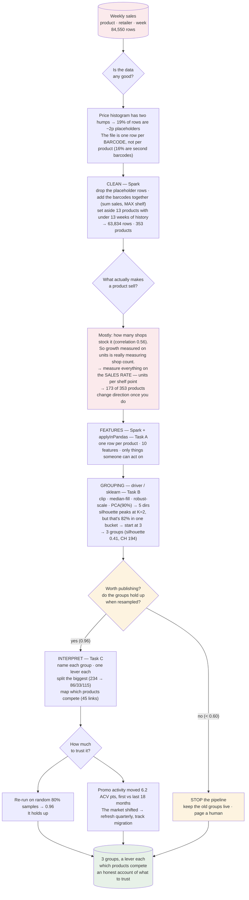
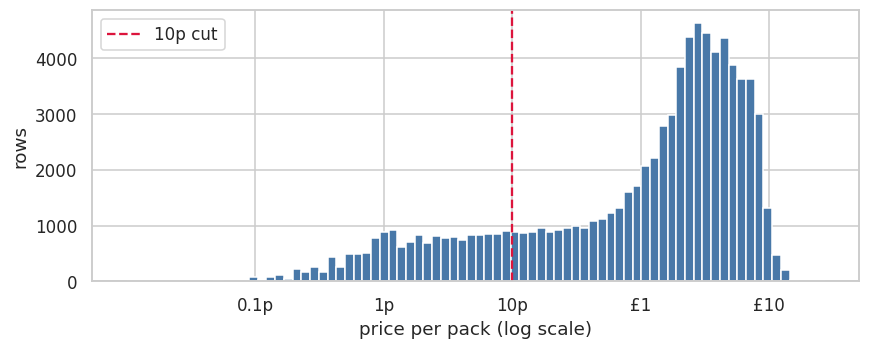
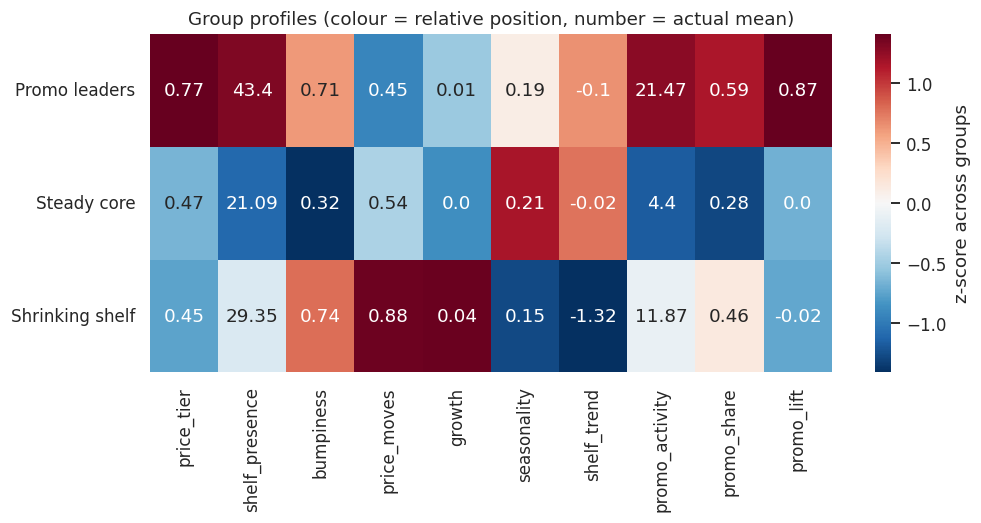
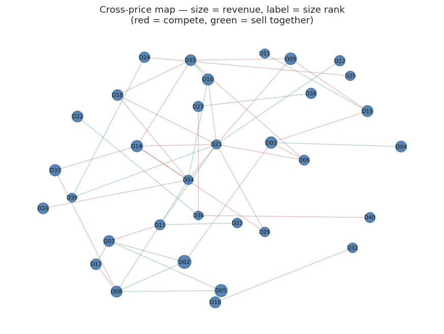
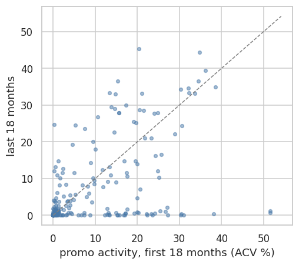

# Product Segmentation from Sales Behaviour

Three years of weekly sales for UK dishwashing products across six retailers — 366 products in
the raw file, 353 once cleaned and old enough to judge. The job: group
products that sell in similar ways, so pricing and promotion can be decided per group instead of
per product — and find which products push each other around.

The full answer to the task is in **[`docs/RGM_Project_Report.docx`](docs/)**. This README covers
what's in the repo, what I found, and how to run it.

---

## What's here

| | |
|---|---|
| [`notebooks/product_segmentation.ipynb`](notebooks/) | The analysis, in **pandas**. Start here — it's where the thinking is. |
| [`notebooks/00_run_pipeline.ipynb`](notebooks/) | Runs the same logic from `src/`, in **PySpark**, the way a scheduled job would. |
| [`src/`](src/) | Five steps: clean → features → group → check → relationships. PySpark for the row-scale work. |
| [`config.yaml`](config.yaml) | Every number the pipeline uses. |
| [`tests/`](tests/) | Plant a pattern in fake data, check the code finds it. |
| [`docs/`](docs/) | The report, and notes on running this in production. |
| [`output/`](output/) | Results. Rewritten from scratch on every run. |

```bash
pip install -r requirements.txt      # then put the dataset in data/ECON_POS.csv
jupyter notebook notebooks/product_segmentation.ipynb   # the analysis (pandas)
jupyter notebook notebooks/00_run_pipeline.ipynb        # the pipeline (PySpark)
```

**pandas for the analysis, PySpark for production.** The notebook is where the analysis was worked
out — it's long, it explains itself, and pandas is the right tool for that. `src/` is the same
logic tidied into functions and moved onto PySpark so it scales past one machine. The pipeline
notebook ends by checking the two still agree: same products, same number of groups, same sizes.

---

## How it fits together



---

## Two things I found in the data before modelling anything

**19% of the rows are placeholders.** The price-per-pack histogram has two humps. The left one is
the same pattern over and over: around 1,000 units for a couple of pounds, which comes to about 2p
a pack. Nothing sells at 2p, and these rows sit right next to a normal-looking row for the same
product and week. Price is revenue ÷ units, so leaving them in would have made every price number
in the analysis wrong. They're 16,395 rows — and only 0.055% of revenue.



**The grain isn't what the brief says.** It describes one row per product, retailer and week. In
fact 13,734 rows (16.2%) are second *barcodes* of the same product — different pack sizes. My first
instinct was `drop_duplicates()`, which would have deleted real sales (every duplicate key has
units on both rows). They need adding together instead — except shelf presence, which takes the
max, because the 30-pack and the 60-pack sit in largely the same shops.

---

## The finding that changed the approach

I asked a simple question before building any features: what actually makes a product sell?

**Mostly, how many shops stock it.** The correlation of log-shelf with log-units is 0.56, so shelf
presence on its own explains roughly a third of the difference between products. Nothing else came
close.

That's a problem, because I was about to measure growth as the trend in weekly units. If units
mostly follow shop count, that number is largely telling me whether a product got listed in more
shops, not whether shoppers want more of it. A product being rolled out would look like a hit; one
being quietly delisted would look like a failure. Those lead to opposite decisions.

So I measure everything on the **sales rate** instead: units divided by (smoothed) shelf presence.
How well does this product sell in the shops that actually stock it? **173 of 353 products change
the direction of their growth** between the two measures — and the disagreement tracks whether
each product is gaining or losing shops (correlation 0.83; 97% of the flips point the same way as
the product's shelf trend), which is the check that the explanation is real rather than convenient.

---

## What came out

Three groups. The silhouette score technically peaks at K=2 — but that answer puts 82% of the
portfolio in a single bucket, which is clean and useless. So the search starts at 3, looks at two
scores plus the group sizes, and lands on **K = 3** (silhouette 0.41, Calinski–Harabasz 194).



| Group | Products | Revenue | What I'd do |
|---|---|---|---|
| **Promo leaders** | 58 | **41%** | Premium for their kind, stocked almost everywhere, ~60% of revenue on deal, heaviest-promo weeks ≈ 1.9× the quietest. Optimise the promo calendar — tune which promotions, and when. |
| **Steady core** | 234 | **49%** | Modest shelf, little promo, flat. Too big and mixed for one lever, so it gets split again (see below). |
| **Shrinking shelf** | 61 | **10%** | Losing more than 1 ACV point of shelf a week, while the rate where it *is* stocked holds up. A distribution question, not a demand one — review the product. |

**The biggest group holds 234 products, 49% of revenue, under one label.** That's not a plan, so it
gets split again (86 / 33 / 115): a big-seller backbone, a promo-seeking middle, and a
115-product micro-distribution tail stocked in ~2% of shops — 81% of which sell in one retailer
only.

Separately, in the largest subcategory, **45 strong links between products that either compete (28)
or sell together (17)**, from a cross-price regression that controls for each product's own price,
its promotions, its shelf, the time trend and total category demand. Those turn into promo-calendar
suggestions: don't promote two products that compete in the same week, because some of the "uplift"
is just sales moving between them. Things to test, not conclusions.



---

## How much to trust it

**Re-running the grouping on 25 random 80% samples gives 0.96 agreement.** I set a pass mark of 0.60
before running it. K-Means clears it comfortably; hierarchical clustering (0.44) doesn't, and a
Gaussian mixture (0.80) sits in between. The more important result is that all three draw broadly
the same map — three methods that work in completely different ways agreeing suggests the groups are
a real feature of the portfolio, not an artefact of K-Means.

The one thing that *doesn't* stay still is the market. Promo activity moved 6.2 ACV points between
the first and last 18 months of the data.



So this needs to be a **quarterly refresh with migration tracking**, not a map drawn once. If a lot
of products move between runs, the answer is to redraw the map and say so — not to quietly republish
something that's shifted underneath the people building plans on it.

What actually happened commercially in 2023–24, I don't know. That's a question for someone who was
there.

---

## What I assumed

The data doesn't say everything, so some calls had to be made. If any of these are wrong, the
answers change.

| Assumption | Why | If it's wrong |
|---|---|---|
| Rows implying **under £0.10 a pack** are data errors | The price histogram has two separate humps, and these sit in the far-left one at ~2p | I'm dropping 19% of rows for nothing, though they're only 0.055% of revenue |
| Several barcodes in one product-week get **added together** | They're different pack sizes of the same product; both rows carry real units | I'd be deleting real sales |
| Shelf presence takes the **max** across barcodes, not the sum | Two pack sizes sit in largely the same shops | Availability is overstated, and the sales rate with it |
| **Under 13 weeks** of history means a product can't be judged | You can't see a trend or a season in less than a quarter | 13 products are set aside that maybe shouldn't be |

There is no made-up promotion threshold anywhere. An earlier version had a rule that a week counted
as "on promotion" above 5% of shops; that number was invented and it moved the segments, so it was
deleted in favour of `any_promo_acv_pct`, which says what actually ran on deal.

---

## Running it as a pipeline

`src/` is the same logic as the notebook, split into five steps and written in **PySpark**.
`00_run_pipeline.ipynb` runs it the way a scheduled job would.

```
clean.py  →  features.py  →  group.py  →  check.py  →  relationships.py
 (Spark)      (Spark)         (driver)     (driver)     (Spark + driver)
                                              │
                                     PUBLISH ─┴─ or STOP
```

**Step 4 can stop the pipeline.** If the groups don't hold up when resampled, the new ones aren't
published: the old ones stay live and someone gets told. People build plans on these groups, and a
segmentation that changes quietly underneath them is worse than one that's slightly out of date.

The orchestrator ends by checking the PySpark pipeline gives the same answer as the pandas analysis
notebook — same 353 products, same 3 groups, same 234/58/61 sizes, same names. If they ever
disagree, someone changed one and not the other, and the job says so.

```bash
python -m pytest tests/ -v
jupyter notebook notebooks/00_run_pipeline.ipynb
```

More detail — including *why* the row-scale steps are Spark and the 353-row model stays
single-node — in [`docs/PRODUCTION.md`](docs/PRODUCTION.md).

---

## Limits, and what I'd do next

**Promo lift here is a comparison, not a measurement.** It compares a product's heaviest promotion
weeks with its quietest ones. It can't tell whether a promotion created a sale or just pulled it
forward from next week. A proper baseline model — what would this product have sold *without* the
promotion — is the first thing I'd build next.

After that: break promotions down by mechanic (I lumped price cuts, features and displays into one
number, and "does a display beat a leaflet" is a question the data can answer), add a tree-based
grouping so people can move between broad and detailed views without a refit, and put the whole
thing on a quarterly schedule.

**The thing I'd most like to know, and the data can't tell me:** when a product's shelf presence
drops, is that our decision or the retailer's? The answer changes what "Shrinking shelf" means —
and 61 products, plus the micro-distribution tail inside Steady core, turn on it.
